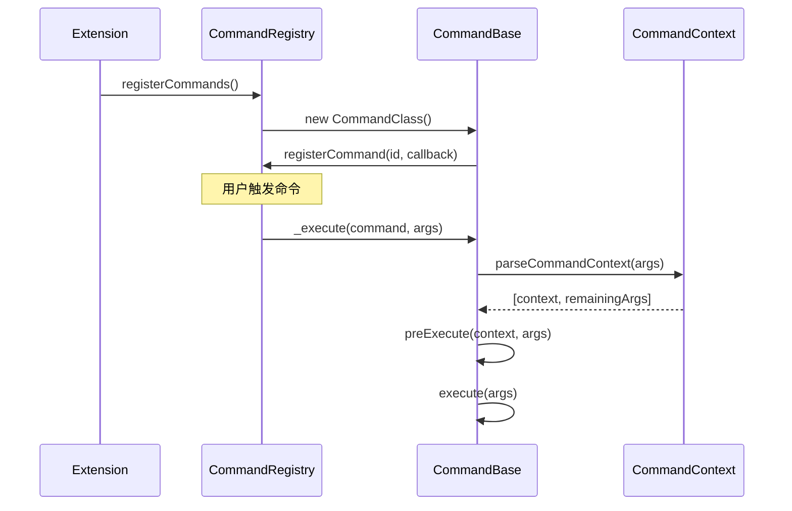
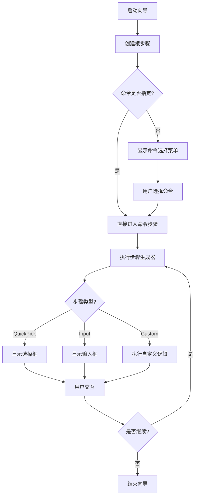

# VSCode扩展架构命令系统设计文档

这是一个基于**命令驱动架构**的VSCode扩展项目，专为AUTOSAR开发环境设计。项目采用了**类型安全**、**模块化**和**可扩展**的设计理念，通过复杂的用户交互流程提供丰富的开发体验。

### 核心特性

- ✅ **类型安全**：完整的TypeScript类型约束系统
- ✅ **命令驱动**：基于VS Code命令系统的架构设计
- ✅ **交互丰富**：支持复杂的向导式用户交互
- ✅ **模块化**：松耦合的组件设计，易于维护和扩展
- ✅ **向后兼容**：完善的废弃API处理机制

## 文件夹结构分析

### 1. 常量定义层 (`packages/common/webviews/constants/`)

```
constants/
├── constants.commands.ts          # 命令ID类型定义和约束
├── constants.commands.generated.ts # 自动生成的命令定义
├── constants.views.ts             # 视图类型和容器定义
├── constants.storage.ts           # 存储键值类型定义
├── constants.ts                   # 基础常量和配置
├── constants.context.ts           # 上下文键定义
├── constants.integrations.ts      # 集成服务类型定义
├── constants.telemetry.ts         # 遥测数据源定义
└── logger.constants.ts            # 日志常量定义
```

**设计原理**：

- **类型安全**：通过TypeScript类型系统确保命令ID、视图ID等不会拼写错误
- **中心化管理**：所有常量集中定义，避免重复和冲突
- **向后兼容**：通过`Deprecated`类型处理废弃的API
- **自动生成**：部分常量通过脚本自动生成，减少手动维护

### 2. 命令系统核心 (`packages/extension/src/common/commands/`)

```
commands/
├── command.ts                     # 命令注册和执行的入口
├── commandBase.ts                 # 命令基类和抽象
├── commandContext.ts              # 命令上下文类型定义
├── commandBase.utils.ts           # 命令工具函数
├── quickCommand.ts                # 快速命令向导基类
├── quickCommand.steps.ts          # 步骤定义逻辑
├── quickCommand.buttons.ts        # 按钮组件定义
├── quickWizard.ts                 # 快速向导命令
├── quickWizard.base.ts            # 快速向导基类
├── quickWizard.utils.ts           # 快速向导工具
└── project/                       # 具体命令实现
    └── project.ts                 # 项目创建命令
```

### 3. 扩展核心 (`packages/extension/src/`)

```
src/
├── extension.ts                   # 扩展入口点
├── container.ts                   # 依赖注入容器
├── core/                         # 核心功能模块
│   ├── configuration.ts          # 配置管理
│   ├── logger.ts                 # 日志系统
│   ├── storage.ts                # 存储管理
│   └── ...
├── services/                     # 业务服务层
├── views/                        # 视图管理
├── webviews/                     # WebView管理
└── utils/                        # 工具函数
```

## 🔧 核心设计原理

### 1. 命令注册机制

```typescript
// 使用装饰器模式自动注册命令
@command()
export class QuickWizardCommand extends QuickWizardCommandBase {
  constructor(container: Container) {
    super(container, ['autosar.project.create']);
  }
}

// 自动收集和注册所有命令
export function registerCommands(container: Container): Disposable[] {
  return registrableCommands.map((c) => new c(container));
}
```

**优势**：

- **自动发现**：通过装饰器自动收集所有命令类
- **类型安全**：命令ID在编译时检查
- **统一管理**：所有命令通过`registerCommands`统一注册
- **生命周期管理**：自动处理命令的创建和销毁

### 2. 上下文解析系统

```typescript
export type CommandContext =
  | CommandUriContext // 单文件上下文
  | CommandUrisContext // 多文件上下文
  | CommandEditorLineContext // 编辑器行上下文
  | CommandScmContext // 源码控制上下文
  | CommandWebViewNodeContext // WebView节点上下文
  | CommandUnknownContext; // 未知上下文

// 智能解析命令上下文
export function parseCommandContext(
  command: GlCommands,
  options?: CommandContextParsingOptions,
  ...args: any[]
): [CommandContext, any[]] {
  // 根据参数类型自动判断上下文类型
}
```

**设计理念**：

- **智能解析**：根据传入参数自动判断命令上下文类型
- **类型约束**：确保命令接收到正确的上下文数据
- **灵活扩展**：支持多种上下文类型
- **参数验证**：自动验证参数的有效性

### 3. 类型安全系统

```typescript
// 命令ID类型约束
export type GlCommands =
  | ContributedCommands // 贡献的命令
  | InternalGlCommands // 内部命令
  | ExternalExecutableCommands; // 外部可执行命令

// 视图类型约束
export type TreeViewTypes = 'SWCTree' | 'APTree' | 'BSWTree';
export type WebviewTypes = 'graph' | 'home' | 'editor' | 'settings';

// 存储键类型约束
export type SecretKeys = 'autosar:license' | 'auth:token' | 'api:key';
```

## 命令系统详解

### 1. 命令基类层次结构

```typescript
// 基础命令类
export abstract class GlCommandBase implements Disposable {
  abstract execute(...args: any[]): any;
  protected _execute(command: GlCommands, ...args: any[]): Promise<unknown>;
}

// 活动编辑器命令
export abstract class ActiveEditorCommand extends GlCommandBase {
  abstract execute(editor?: TextEditor, ...args: any[]): any;
}

// 编辑器命令（无上下文解析）
export abstract class EditorCommand implements Disposable {
  abstract execute(editor: TextEditor, edit: TextEditorEdit, ...args: any[]): any;
}
```

### 2. 命令注册和执行流程



### 3. 命令工具函数

```typescript
// 执行autosar命令
export function executeCommand<T = unknown, U = any>(command: GlCommands, ...args: T[]): Thenable<U>;

// 执行VS Code核心命令
export function executeCoreCommand<T = unknown, U = any>(command: CoreCommands, ...args: T[]): Thenable<U>;

// 创建终端链接命令
export function createTerminalLinkCommand<T extends object>(
  command: GlCommands,
  args: T
): { command: GlCommands; args: T };
```

## 🎭 快速命令向导系统

### 1. 核心组件

```typescript
// 快速命令基类
export abstract class QuickCommand<State = any> implements QuickPickItem {
  protected abstract steps(state: PartialStepState<State>): StepGenerator;
  async next(value?: StepSelection<any>): Promise<IteratorResult<...>>
  async previous(): Promise<QuickPickStep | QuickInputStep | undefined>
}

// 步骤类型
export type StepGenerator =
  | Generator<QuickPickStep | QuickInputStep | CustomStep, StepResult<void>>
  | AsyncGenerator<QuickPickStep | QuickInputStep | CustomStep, StepResult<void>>
```

### 2. 步骤类型详解

```typescript
// QuickPick步骤
export interface QuickPickStep<T extends QuickPickItem = QuickPickItem> {
  type: 'pick';
  items: (DirectiveQuickPickItem | T)[] | Promise<(DirectiveQuickPickItem | T)[]>;
  multiselect?: boolean;
  placeholder?: string | ((count: number) => string);
  onDidAccept?: (quickpick: QuickPick<T>) => boolean | Promise<boolean>;
  // ... 更多配置选项
}

// Input步骤
export interface QuickInputStep<T extends string = string> {
  type: 'input';
  placeholder?: string;
  validate?: (value: T | undefined) => [boolean, T | undefined] | Promise<[boolean, T | undefined]>;
  onDidPressKey?: (input: InputBox, key: Keys) => void | Promise<void>;
  // ... 更多配置选项
}

// 自定义步骤
export interface CustomStep<T = unknown> {
  type: 'custom';
  show(step: CustomStep<T>): Promise<StepResult<Directive | T>>;
}
```

### 3. 向导执行流程



### 4. 按钮组件系统

```typescript
// 切换按钮
export class ToggleQuickInputButton implements QuickInputButton {
  constructor(
    private readonly state: {
      on: { icon: string | ThemeIcon; tooltip: string };
      off: { icon: string | ThemeIcon; tooltip: string };
    },
    private _on = false
  ) {}

  onDidClick?(quickInput: QuickInput): boolean | void | Promise<boolean | void>;
}

// 预定义按钮
export const LoadMoreQuickInputButton: QuickInputButton = {
  iconPath: new ThemeIcon('refresh'),
  tooltip: 'Load More'
};

export const WillConfirmToggleQuickInputButton = class extends ToggleQuickInputButton {
  constructor(on = false, isConfirmationStep: boolean, onDidClick?: (quickInput: QuickInput) => void);
};
```

## 常量管理系统

### 1. 命令常量定义

```typescript
// 内部命令类型
type InternalCommands =
  | 'autosar.file.rename'
  | 'autosar.file.move'
  | 'autosar.file.copy'
  | 'autosar.file.delete'
  | 'autosar.project.create'
  | 'autosar.project.open'
  | 'autosar.project.close'
  | 'autosar.theme.change'
  | 'autosar.language.change'
  | 'autosar.configuration.update';

// 外部可执行命令
type ExternalExecutableCommands =
  | 'autosar.executeExternal'
  | 'autosar.manageExternal'
  | 'autosar.external.start'
  | 'autosar.external.stop'
  | 'autosar.external.restart';

// 核心命令（VS Code内置）
export type CoreCommands =
  | 'cursorMove'
  | 'editor.action.showHover'
  | 'vscode.open'
  | 'workbench.action.openSettings'
  | `${ViewContainerIds | CoreViewContainerIds}.resetViewContainerLocation`;
```

### 2. 视图类型定义

```typescript
// 树视图类型
export type TreeViewTypes = 'SWCTree' | 'APTree' | 'BSWTree';
export type TreeViewIds<T extends TreeViewTypes = TreeViewTypes> = `autosar.views.${T}`;

// WebView类型
export type WebviewTypes = 'graph' | 'home' | 'editor' | 'settings';
export type WebviewIds = `autosar.${WebviewTypes}`;

// 视图容器类型
export type ViewContainerTypes = 'autosarswc' | 'autosar_terminal';
export type ViewContainerIds = `workbench.view.extension.${ViewContainerTypes}`;

// 视图节点类型
export type TreeViewNodeTypes = 'file' | 'folder' | 'project' | 'system' | 'editor';
```

### 3. 存储键定义

```typescript
// 密钥存储
export type SecretKeys = 'autosar:license' | 'auth:token' | 'api:key';

// 工作区存储
export type WorkspaceStorage = {
  currentNode: TreeNode;
};

// 全局存储
export type GlobalStorage = {
  'project.sort': boolean;
};

// 废弃存储（向后兼容）
export type DeprecatedGlobalStorage = {
  /** @deprecated use `project.sort` */
  'test1project.sortDeprecated': boolean;
};
```

### 4. 集成服务定义

```typescript
// 集成ID类型
export type IntegrationIds = 'BuildProject' | 'RuleVerifier' | ExecutableIntegrationIds | ExecutableProviderType;

// 可执行程序集成
export enum ExecutableIntegrationIds {
  Git = 'git',
  Docker = 'docker',
  Custom = 'custom'
}

// 可执行程序提供者类型
export enum ExecutableProviderType {
  VersionControl = 'version-control',
  Container = 'container',
  Orchestration = 'orchestration',
  Build = 'build',
  Test = 'test',
  Custom = 'custom'
}
```

## 使用用例与示例

### 1. 创建基础命令

```typescript
// 1. 在constants.commands.ts中定义命令ID
type InternalCommands = 'autosar.file.rename' | 'autosar.project.create';

// 2. 实现命令类
export class RenameFileCommand extends GlCommandBase {
  constructor() {
    super('autosar.file.rename');
  }

  execute(...args: any[]): any {
    // 命令逻辑实现
    console.log('重命名文件命令执行');
  }
}

// 3. 使用装饰器注册
@command()
export class RenameFileCommand extends GlCommandBase {
  // 自动注册到VS Code命令系统
}
```

### 2. 实现复杂交互流程

```typescript
export class ProjectCommand extends QuickCommand {
  protected async *steps(state: PartialStepState<any>): StepGenerator {
    const context: Context = {
      repos: 'projects',
      label: ''
    };

    // Step 1: 选择工程类型
    const projectTypeStep = createPickStep({
      title: '创建工程',
      placeholder: '请选择工程类型',
      items: [
        { label: 'LIB工程', description: '创建一个LIB工程' },
        { label: '应用工程', description: '创建一个应用工程' },
        { label: 'ECU配置工程', description: '创建一个ECU配置工程' }
      ]
    });

    const projectTypeSelection: StepSelection<typeof projectTypeStep> = yield projectTypeStep;
    if (!canPickStepContinue(projectTypeStep, state, projectTypeSelection)) {
      return StepResultBreak;
    }

    context.label = projectTypeSelection[0].label;

    // Step 2: 选择AP或CP
    const apCpStep = createPickStep({
      title: `选择选项 - ${context.label}`,
      placeholder: '请选择AP或CP',
      items: [
        { label: 'AP', description: '选择AP选项' },
        { label: 'CP', description: '选择CP选项' }
      ]
    });

    const apCpSelection: StepSelection<typeof apCpStep> = yield apCpStep;
    if (!canPickStepContinue(apCpStep, state, apCpSelection)) {
      return StepResultBreak;
    }

    // Step 3: 输入工程名称
    const projectNameStep = createInputStep({
      title: `创建工程 - ${context.label}`,
      placeholder: '请输入工程名称',
      validate: async (value) => {
        if (!value || value.trim().length === 0) {
          return [false, '工程名称不能为空'];
        }
        return [true, value];
      }
    });

    const projectName: StepSelection<typeof projectNameStep> = yield projectNameStep;
    if (!canInputStepContinue(projectNameStep, state, projectName)) {
      return StepResultBreak;
    }

    // 返回最终结果
    return Promise.resolve(`./projects/${context.label}_${apCpSelection[0].label}_${projectName}`);
  }
}
```

### 3. 自定义按钮和交互

```typescript
// 创建上下文相关的切换按钮
export class FileContextQuickInputButton extends ToggleQuickInputButton {
  constructor(
    private readonly context: {
      hasCommit?: boolean;
      hasFile?: boolean;
      allowRename?: boolean;
    },
    on = false
  ) {
    super(
      () => ({
        on: {
          tooltip: '隐藏文件操作',
          icon: new ThemeIcon('chevron-up')
        },
        off: {
          tooltip: '显示文件操作',
          icon: new ThemeIcon('chevron-down')
        }
      }),
      on
    );
  }

  override onDidClick(_quickInput: QuickInput): boolean | void {
    // 切换文件操作可见性
    this.on = !this.on;
    return true; // 刷新界面
  }
}

// 在步骤中使用自定义按钮
const step = createPickStep({
  title: '文件操作',
  placeholder: '选择要执行的操作',
  buttons: [new FileContextQuickInputButton({ hasFile: true })],
  items: getFileOperations()
});
```

### 4. 命令上下文处理

```typescript
export class FileOperationCommand extends ActiveEditorCommand {
  execute(editor?: TextEditor, uri?: Uri, ...args: any[]): any {
    // 自动获取活动编辑器
    const activeEditor = editor || window.activeTextEditor;
    if (!activeEditor) {
      window.showErrorMessage('没有活动的编辑器');
      return;
    }

    // 获取文件URI
    const fileUri = uri || activeEditor.document.uri;

    // 执行文件操作
    this.performFileOperation(fileUri, args);
  }

  private performFileOperation(uri: Uri, args: any[]): void {
    // 具体的文件操作逻辑
  }
}
```

### 5. 跨命令调用

```typescript
// 创建跨命令引用
export function createCrossCommandReference<T>(command: GlCommands, args: T): CrossCommandReference<T> {
  return { command: command, args: args };
}

// 在命令中调用其他命令
export class MainCommand extends GlCommandBase {
  execute(...args: any[]): any {
    // 创建对其他命令的引用
    const subCommandRef = createCrossCommandReference('autosar.project.create', {
      confirm: true,
      source: 'webview'
    });

    // 执行子命令
    return executeCommand(subCommandRef.command, subCommandRef.args);
  }
}
```

## 开发者指南

```bash
# 步骤1: 定义命令ID
# 在 packages/common/webviews/constants/constants.commands.ts 中添加
type InternalCommands = 'autosar.new.command' | ...;

# 步骤2: 创建命令类
# 在 packages/extension/src/common/commands/ 中创建新文件
export class NewCommand extends GlCommandBase {
  constructor() {
    super('autosar.new.command');
  }

  execute(...args: any[]): any {
    // 实现命令逻辑
  }
}

# 步骤3: 注册命令
@command()
export class NewCommand extends GlCommandBase {
  // 自动注册
}
```

### 3. 创建复杂交互

```bash
# 步骤1: 继承QuickCommand
export class ComplexCommand extends QuickCommand {
  protected async *steps(state: PartialStepState<any>): StepGenerator {
    // 实现步骤逻辑
  }
}

# 步骤2: 定义步骤
const step = createPickStep({
  title: '步骤标题',
  placeholder: '选择选项',
  items: [...],
  onDidAccept: async (quickpick) => {
    // 处理用户选择
    return true; // 继续下一步
  }
});

# 步骤3: 控制流程
const selection = yield step;
if (!canPickStepContinue(step, state, selection)) {
  return StepResultBreak;
}
```

### 4. 自定义UI组件

```bash
# 步骤1: 继承按钮基类
export class CustomButton extends ToggleQuickInputButton {
  constructor(config: ButtonConfig) {
    super(config.state, config.initialState);
  }

  override onDidClick(quickInput: QuickInput): boolean | void {
    // 处理点击事件
    return true; // 刷新界面
  }
}

# 步骤2: 在步骤中使用
const step = createPickStep({
  buttons: [new CustomButton(config)],
  // 其他配置...
});
```

### 5. 错误处理和验证

```typescript
// 输入验证
const inputStep = createInputStep({
  validate: async (value) => {
    if (!value || value.trim().length === 0) {
      return [false, '值不能为空'];
    }
    if (value.length < 3) {
      return [false, '值长度至少为3个字符'];
    }
    return [true, value];
  }
});

// 选择验证
const pickStep = createPickStep({
  validate: (selection) => {
    return selection.length > 0; // 至少选择一个选项
  }
});

// 错误处理
try {
  const result = await executeCommand('autosar.project.create', args);
  window.showInformationMessage('项目创建成功');
} catch (error) {
  window.showErrorMessage(`创建失败: ${error.message}`);
}
```
